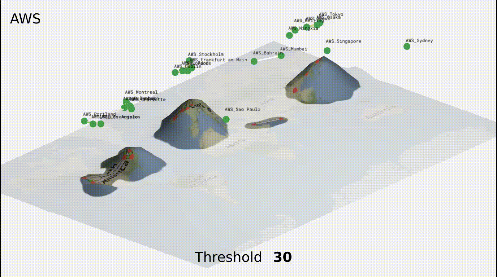
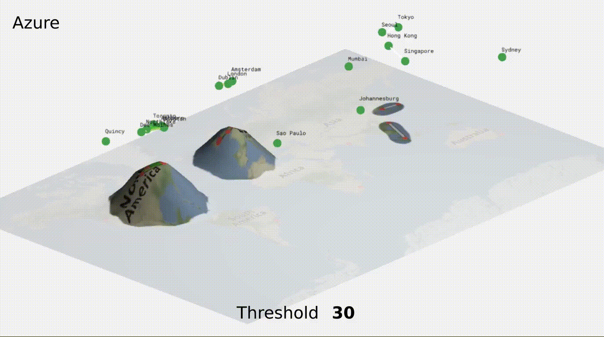
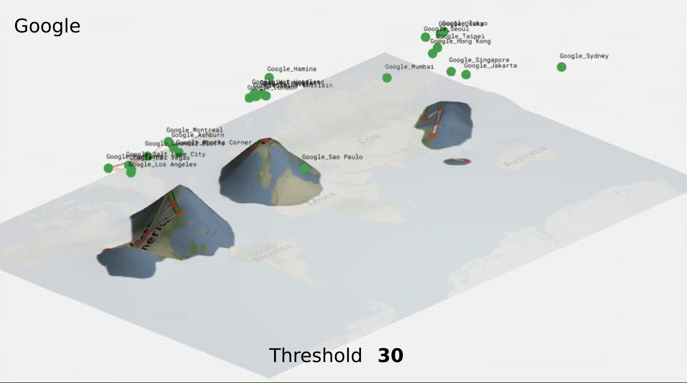
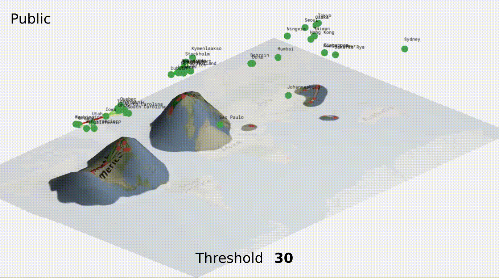

# Geometry-of-Measured-Internet-Latencies-
This repository aims at providing dynamical views of the different figure of the paper : On the Geometry of Measured Internet Latencies: A Curvature-based Analysis and its Applications

# Animated Manifolds
These gifs show the manifolds for **AWS**, **Azure**, **Google**, and **public** infrastructures at thresholds of **30**, **60**, **90** and **120**.

